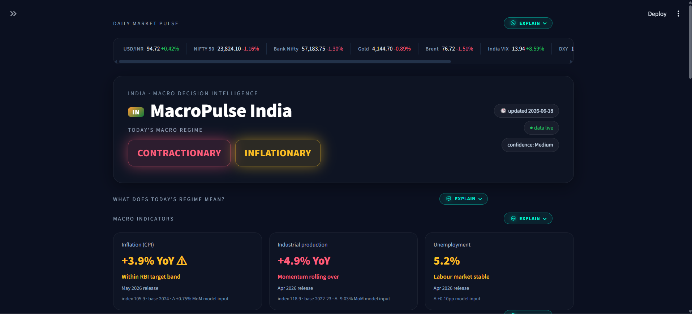
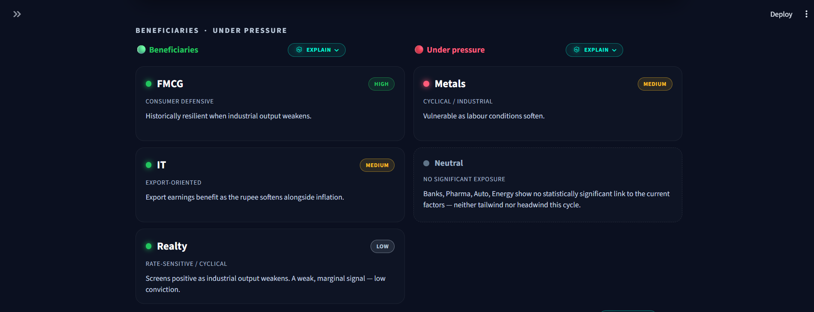
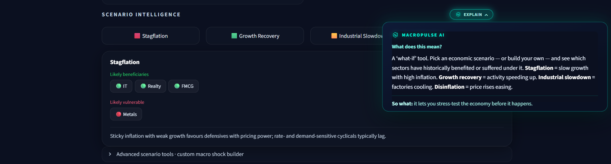
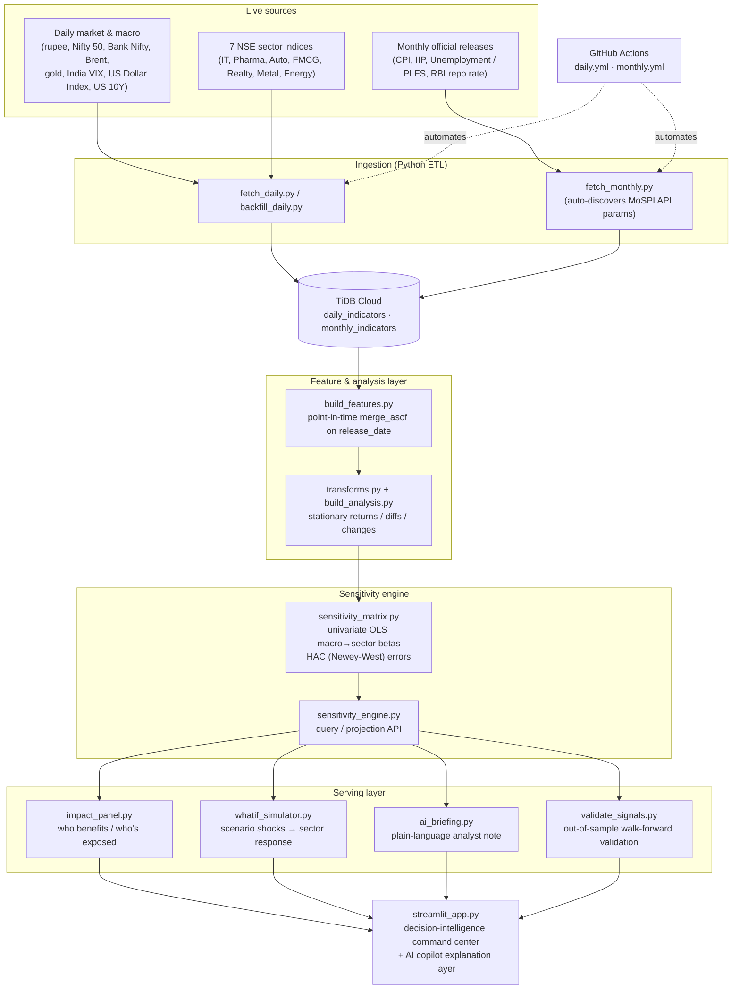

# MacroPulse India 🇮🇳

### A self-updating macroeconomic decision-intelligence platform that turns India's live macro data into explainable, **out-of-sample-validated** sector intelligence.
## Dashboard Overview



## Validation Layer



## AI Copilot



[](https://macropulse-india.streamlit.app/)
[](https://www.python.org/)
[](https://tidbcloud.com/)
[](https://github.com/features/actions)
[](https://macropulse-india.streamlit.app/)

> **What it is in one line:** a decision-support tool that reads the Indian economy each day, estimates which equity **sectors** are favoured or exposed, **tests whether those signals hold up on data the model never saw**, and explains every concept in plain English for non-economists.
>
> **What it is not:** a stock-price predictor. It is *decision intelligence* — explainable sensitivities, scenario analysis, and analyst briefings, with the statistical honesty to flag what it cannot prove.

<!-- 📸 ADD A SCREENSHOT OR GIF HERE — this is the single highest-impact thing for a 30-second skim.
     Capture the command-center view and save it as docs/command-center.png, then uncomment: -->
<!--  -->

---

##  Why this project is different 

Most analytics portfolios stop at "I built a dashboard." MacroPulse goes three steps further:

- ** It validates itself.** Every sector signal is tested **out-of-sample** with point-in-time, walk-forward validation — so the dashboard can tell you which calls to *trust* and which to *caveat*, backed by evidence rather than intuition. (Of 11 production signals: **3 validated, 8 partial, 0 that failed outright.**)
- ** It explains itself.** An in-product **AI copilot** translates every concept — *contractionary regime, consumer-defensive, stagflation* — into plain English plus its business implication, so a recruiter, manager, or curious student understands the platform without an economics degree.
- ** It runs itself.** A cloud-native, CI-driven pipeline ingests live data daily and monthly, engineers **lookahead-audited** features, and refreshes the whole stack automatically.
- ** It's framed for decisions, not just data.** Built from an economics-first perspective: the question is always "what does this *mean* for a business," not "here is a regression."

---

##  The problem it solves

Macroeconomic data is **abundant but illegible**. A business leader, analyst, or investor can see that inflation is up and factory output is down — but translating that into *"which parts of the economy are likely to hold up, and which are exposed?"* requires economics fluency, statistical modelling, and constant manual updating.

MacroPulse closes that gap. It continuously answers three questions a decision-maker actually has:

1. **Where are we?** — What macroeconomic regime is India in right now? *(e.g. "slowing growth + rising prices")*
2. **So what?** — Which equity sectors does that environment favour or pressure, and **how confident should we be**?
3. **What if?** — How would the picture change if inflation spiked, or industrial output recovered?

---

##  What it does

| Capability | What it delivers |
|---|---|
| **Live macro regime** | Classifies today's environment (contractionary/expansionary × inflationary/disinflationary) from official releases. |
| **Sector sensitivity engine** | HAC-corrected macro→sector betas — the analytical core. Quantifies how each NSE sector historically moves with inflation, industrial output, and unemployment. |
| **Out-of-sample trust layer** | Walk-forward + holdout validation of every signal, surfaced as **Validated / Partial / In-sample-only** chips next to each call. |
| **What-if simulator** | Apply hypothetical macro shocks ("inflation rises 1%, output falls 3%") and project the sector response. |
| **AI analyst briefing** | A daily plain-language note synthesising the live market tape, the macro regime, and the model's proprietary read. |
| **AI copilot explainer** | Click-to-explain panels on every section translating *concept → plain English → business implication*. |
| **Auto-updating pipeline** | Daily market + monthly macro ingestion, CI-driven and self-healing, with point-in-time correctness. |

---

##  Architecture

A layered pipeline: raw sources → cloud database → point-in-time features → a stationary analysis layer → the sensitivity engine → four serving components → the dashboard. Each layer is independently testable, and macro releases are aligned by **release date** (never by reference month) so the model can never "see the future."



---

##  Methodology & validation

The analytical core is a **sector-sensitivity matrix**: for each NSE sector and each macro factor, a univariate regression of the sector's stationary return on the factor's change, `rᵢ = a + b·mⱼ`. Three deliberate choices make it defensible:

- **Point-in-time correctness.** Monthly releases are joined on their *actual release date* (CPI ≈ 12th of the next month, IIP ≈ 6 weeks later), so the model is never trained on information that wasn't yet public — no lookahead.
- **Stationarity first.** Everything is modelled on returns / differences / release-step changes, removing the spurious level-on-level correlation that makes naive macro dashboards lie.
- **HAC standard errors.** Because the held-constant macro factor is a monthly step function with strong serial correlation, daily regressions use Newey-West (HAC) errors so t-stats aren't inflated. Significance is treated as a *licence to abstain* — non-significant relationships are shown as "no exposure," not forced into a story.

### The out-of-sample result

In-sample significance is not enough — a relationship can fit the data it was estimated on and evaporate on new data. So every production signal is re-tested **out-of-sample**, on **monthly** aggregates (the macro factors are monthly step-functions, so a daily split would leak and pseudo-replicate), using:

- a **holdout** split (train on earlier months, score later months), and
- an **expanding-window walk-forward** (one-step-ahead, point-in-time),
- scored with **Campbell–Thompson out-of-sample R²** (a negative value means the signal predicts *worse* than guessing the average) and a directional hit-rate.

| Signal | Verdict | Out-of-sample read |
|---|---|---|
| **Nifty 50 × Industrial production** |  Validated | OOS R² **+0.107**, directional hit-rate **85.7%** |
| **FMCG × Industrial production** |  Validated | The strongest dashboard-supported signal — corroborates the headline "defensive" call |
| **IT × Industrial production** |  Direction only | Stable *sign* and direction, but holdout R² **−24.4** → trust the direction, **not** the magnitude |

> **Honest limitation, stated up front:** with ≈13 months of macro history this is an **early robustness read, not proof** — and "0 signals failed outright" is partly a small-sample effect. The defensible claim is *"no shipped signal failed, and the most-relied-on signal validated,"* not *"everything is proven."* The framework is built to sharpen automatically as history accrues. Surfacing that caveat **in the product itself** is the point.

---

##  Tech stack

**Language & analysis:** Python · pandas · NumPy · statsmodels (OLS, HAC)
**Storage:** TiDB Cloud (MySQL-compatible, TLS)
**App & visualisation:** Streamlit · Plotly
**Automation:** GitHub Actions (scheduled daily & monthly refresh)
**Explanation layer:** curated knowledge base (with an optional Anthropic-API live-narration hook)

---

##  Run it locally

```bash
# 1. Clone and install
git clone https://github.com/garima-nandal17/MacroPulse-India.git
cd MacroPulse-India
pip install -r requirements.txt

# 2. Configure database credentials (.env)
#    DB_HOST=... DB_PORT=... DB_USER=... DB_PASSWORD=... DB_NAME=macropulse_india

# 3. Build the data → analysis → signals pipeline
python build_features.py        # point-in-time features
python build_analysis.py        # stationary analysis layer
python sensitivity_matrix.py    # macro→sector betas
python validate_signals.py      # out-of-sample validation table

# 4. Launch the command center
streamlit run streamlit_app.py
```

> The dashboard **degrades gracefully**: if the validation table isn't built yet, the trust chips simply don't appear and everything else works.

---

##  Project structure

```
MacroPulse-India/
├── fetch_daily.py / backfill_daily.py   # daily market ingestion
├── fetch_monthly.py                     # monthly macro ingestion (auto-discovers API params)
├── build_features.py / transforms.py    # point-in-time, stationary feature engineering
├── build_analysis.py                    # materialises the stationary analysis layer
├── sensitivity_matrix.py                # macro→sector betas (HAC-corrected)
├── sensitivity_engine.py                # query / projection service layer
├── impact_panel.py                      # beneficiaries vs exposed sectors
├── whatif_simulator.py                  # scenario / shock projection
├── ai_briefing.py                       # plain-language analyst note
├── validate_signals.py                  # out-of-sample walk-forward validation
├── streamlit_app.py                     # dashboard + AI copilot explanation layer
├── .github/workflows/                   # daily.yml · monthly.yml (CI automation)
└── RUNLOG_DAY*.md                       # decision logs (the "why" behind each build day)
```
---

<sub>Built and maintained by **Garima Nandal** · [GitHub](https://github.com/garima-nandal17) · A decision-intelligence project, honestly benchmarked.</sub>
